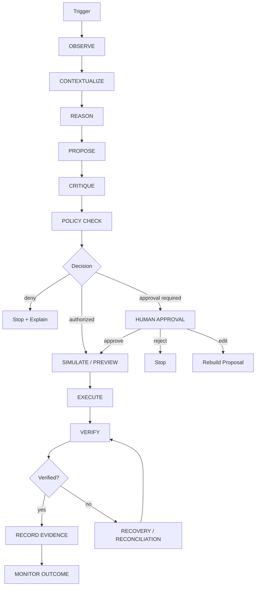
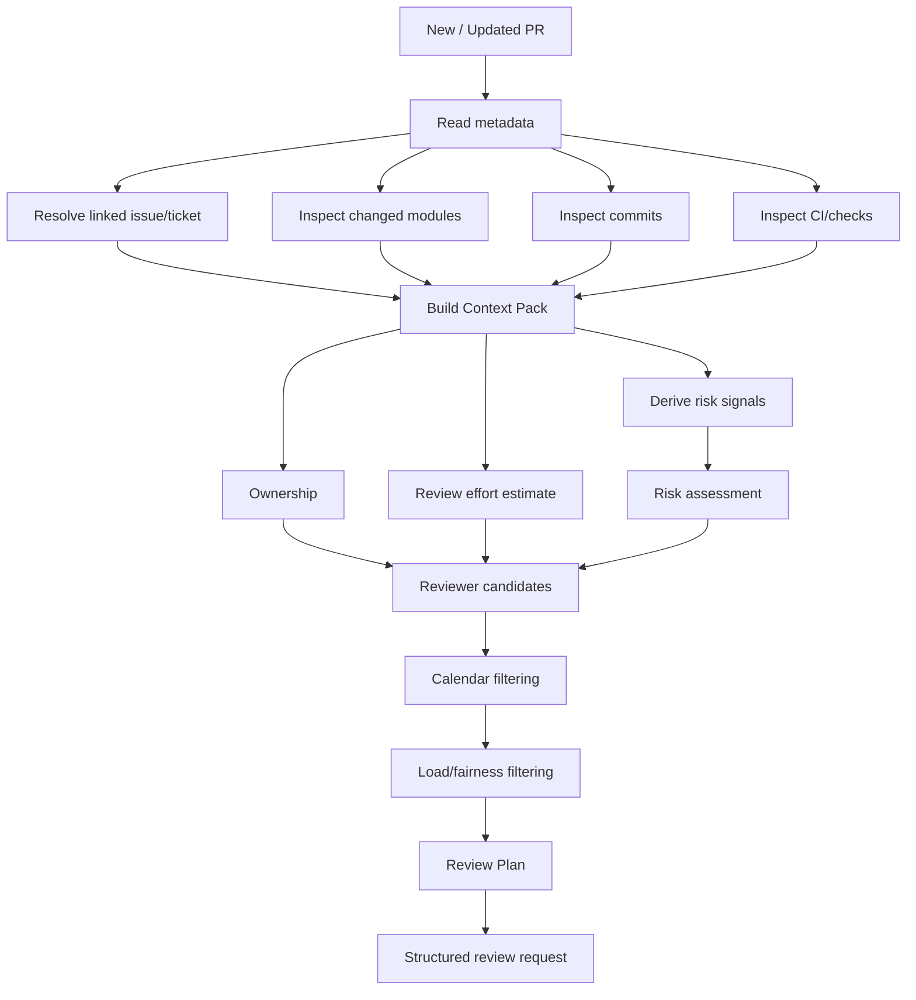
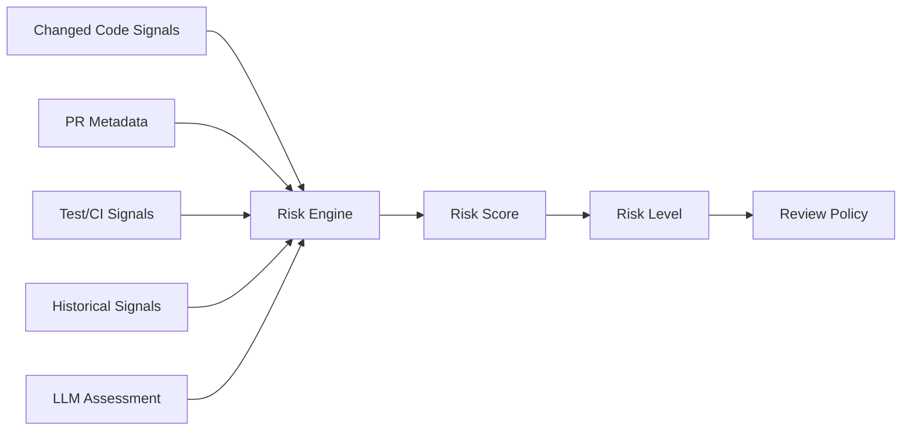
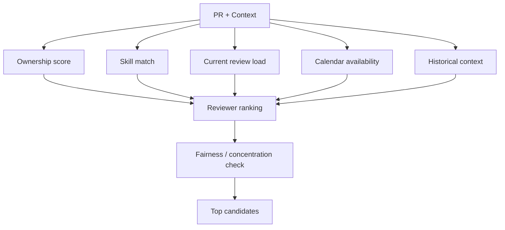
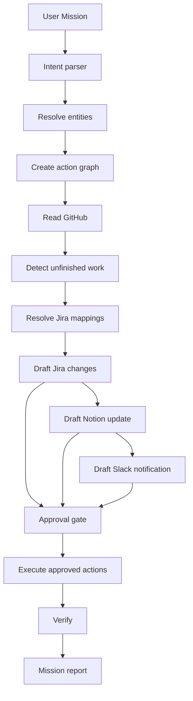
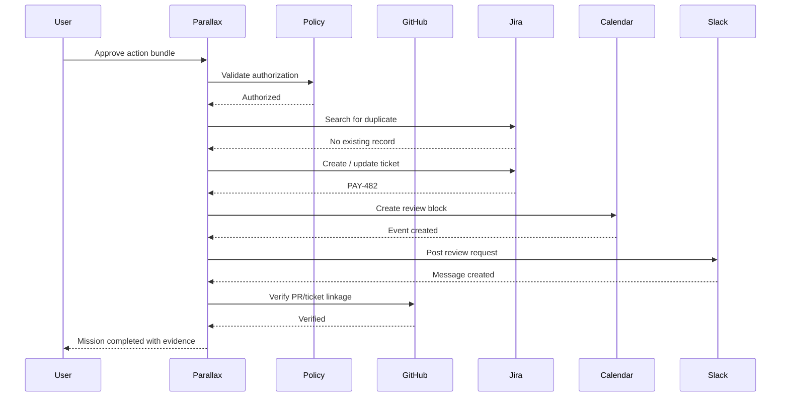
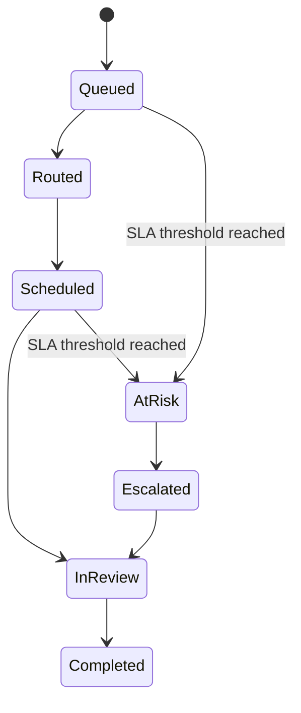

# Parallax — Agent Flow, Reasoning Model & Execution Diagrams

---

# 1. Core agent invariant

Parallax is not a free-running autonomous bot.

Its lifecycle is:

**OBSERVE → CONTEXTUALIZE → REASON → PROPOSE → CRITIQUE → POLICY → APPROVAL → EXECUTE → VERIFY → RECORD**

The exact sequence may shorten for low-risk read-only actions, but write operations must still respect policy.

---

# 2. High-level agent flow



---

# 3. Stage definitions

## OBSERVE

Inputs:

- webhook
- scheduled poll
- user mission
- manual button

Output:

- normalized event

No reasoning side effects.

---

## CONTEXTUALIZE

Collect:

- repository
- PR
- issue/ticket
- commits
- changed files
- ownership
- related PRs
- checks/tests
- Slack/project context
- documentation
- calendar information where needed

Output:

**Context Graph**

---

## REASON

Determine:

- what is happening
- why it matters
- what is missing
- risk
- likely review effort
- reviewer candidates
- proposed next step

The reasoner should cite evidence.

---

## PROPOSE

Convert reasoning into explicit typed actions.

Example:

```json
{
  "action": "schedule_review",
  "target": {
    "reviewer": "user_123",
    "pr": "github_pr_482"
  },
  "start": "2026-09-12T15:00:00",
  "duration_minutes": 45,
  "reason": [
    "owns changed payment service",
    "no conflicting focus block",
    "recently reviewed adjacent PRs"
  ]
}
```

The above is conceptual; actual implementation should use validated schemas.

---

## CRITIQUE

Before policy, the agent checks:

- Does the proposal use evidence?
- Is the target unambiguous?
- Is the action reversible?
- Are there conflicting states?
- Is the confidence adequate?
- Is the action within scope?
- Is a lower-impact alternative available?

---

# 4. PR triage agent flow



---

# 5. Context Pack generation

The system should use a retrieval-first approach.

```text
PR
 ↓
Metadata retrieval
 ↓
Linked work retrieval
 ↓
Repository structure retrieval
 ↓
Targeted diff retrieval
 ↓
Relevant file/module retrieval
 ↓
Tests/checks retrieval
 ↓
Ownership retrieval
 ↓
Related work retrieval
 ↓
Context assembly
 ↓
LLM synthesis
 ↓
Evidence attachment
```

Avoid sending entire repositories to the model.

---

# 6. Risk reasoning

Use a hybrid engine.



Possible weighted dimensions:

- security
- money movement
- data integrity
- database changes
- infrastructure
- external API impact
- size
- test weakness
- ownership anomaly
- dependency change

---

# 7. Reviewer routing



Ranking should be transparent.

Example explanation:

> Alex ranks first because they own the changed payment module, have reviewed adjacent changes recently, have a 45-minute window within the next two hours, and are below the team's configured review-load threshold.

---

# 8. Mission planner

A natural language mission becomes an executable graph.

Example mission:

> Review Payments, find unfinished GitHub work, sync to Jira, document in Notion, and notify Slack.



---

# 9. Planner output

The planner should produce a graph containing:

```text
Goal
Entities
Assumptions
Evidence requirements
Steps
Dependencies
Potential mutations
Approval requirements
Rollback/reconciliation approach
Success criteria
```

Example:

```text
Goal:
Synchronize unfinished Payments work.

Preconditions:
- Payments repository is connected.
- PAY Jira project exists.
- Payments Slack channel is connected.

Steps:
1. Read PRs.
2. Resolve linked tickets.
3. Detect mismatches.
4. Propose Jira changes.
5. Request approval.
6. Execute.
7. Verify.
8. Update Notion.
9. Notify Slack.
10. Produce report.
```

---

# 10. Approval model

Approvals should operate on action bundles.

Each approval includes:

- what will change
- where
- why
- evidence
- expected result
- risk
- affected systems
- reversibility

Example:

```text
Approval bundle #A-1882

Changes:
+ Create Jira PAY-482
+ Link GitHub PR #482
+ Add review event to Alex's calendar
+ Post #payments message

Risk: Medium
Confidence: High

[Approve]
[Edit]
[Reject]
```

---

# 11. Execution flow



---

# 12. Failure handling

## GitHub succeeds, Jira fails

Mission becomes:

`PARTIALLY_COMPLETE`

The system should:

1. preserve GitHub result
2. retry Jira if appropriate
3. avoid duplicating the GitHub mutation
4. tell the user exactly what remains

## Calendar succeeds, Slack times out

Do not blindly post twice.

First:

- query Slack if possible
- verify whether the message exists
- then retry only when state is known

---

# 13. Review SLA lifecycle



Each state transition is an event.

---

# 14. Outcome learning

After a review:

Collect:

- actual review duration
- reviewer changes
- number of review cycles
- requested changes
- merge duration
- risk accuracy
- effort estimate error
- routing success

Use this data to improve:

- reviewer ranking
- effort estimation
- bottleneck prediction

Do not use silent online learning that changes production behavior without evaluation.

Prefer versioned scoring models.

---

# 15. Agent memory

Parallax should distinguish:

### Short-term workflow state

- current mission
- current PR
- current approval
- pending action

### Long-term organizational memory

- project conventions
- reviewer expertise
- ownership
- policy
- documented decisions

### Evidence

Immutable records of what happened.

Do not treat conversational history as authoritative organizational truth.

---

# 16. Human-in-the-loop boundaries

### Read-only

May be automatic:

- search
- retrieve
- classify
- summarize
- calculate
- recommend

### Low-risk writes

May be automatic if tenant policy allows:

- labels
- internal notes
- non-notifying metadata

### Medium-risk writes

Default approval:

- create Jira issue
- create calendar event
- Slack notification
- project documentation update

### High-risk writes

Always explicit approval:

- merge PR
- close PR
- destructive update
- delete data
- change permissions
- modify production infrastructure

---

# 17. Agent observability

Every reasoning run should have:

- run ID
- prompt/version identifier
- model identifier
- tool calls
- input sources
- output schema
- confidence
- policy result
- final action
- verification result
- latency
- token/cost metrics where available

Never make hidden model calls that cannot be traced.

---

# 18. Anti-patterns

Do not build:

### One giant autonomous prompt

It becomes impossible to test and govern.

### Direct LLM-to-Slack/GitHub execution

Reasoning and mutation must be separated.

### Database as hidden agent memory

Memory should have explicit data ownership and retention.

### "Magic" confidence scores

Every score needs component signals.

### Fully automatic merge

Not in MVP.

### Tool-by-tool chatbot

Parallax's differentiation is workflow orchestration, not chat.

---

# 19. Final flow

```text
EVENT / MISSION
      ↓
OBSERVE
      ↓
CONTEXT GRAPH
      ↓
REASON
      ↓
STRUCTURED PROPOSAL
      ↓
CRITIQUE
      ↓
POLICY
      ↓
HUMAN APPROVAL WHEN REQUIRED
      ↓
DETERMINISTIC EXECUTION
      ↓
VERIFICATION
      ↓
EVIDENCE + AUDIT
      ↓
OUTCOME MONITORING
      ↓
ANALYTICS / REVIEW DEBT
```

This is the core Parallax operating model.
